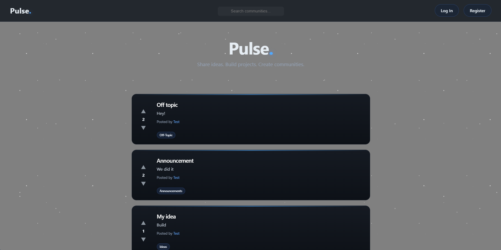
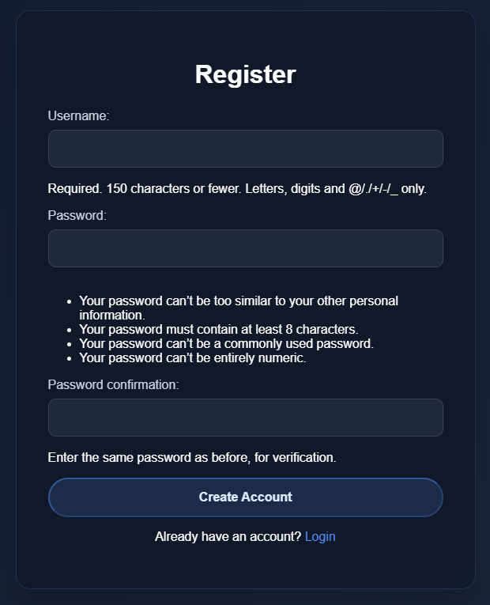
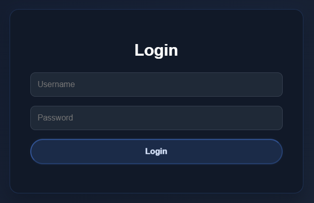
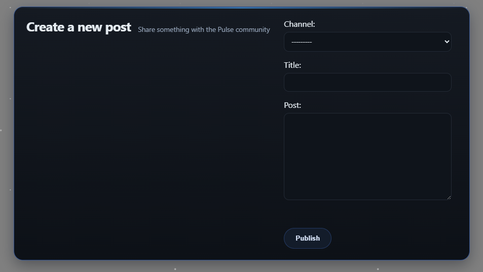
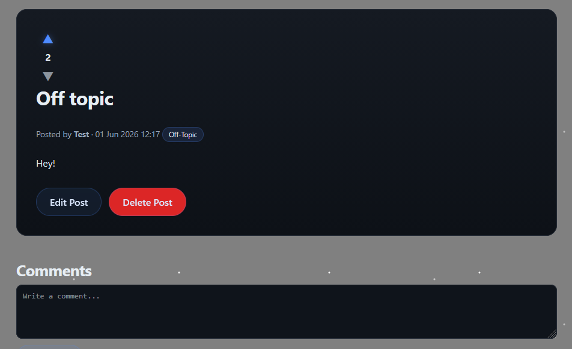
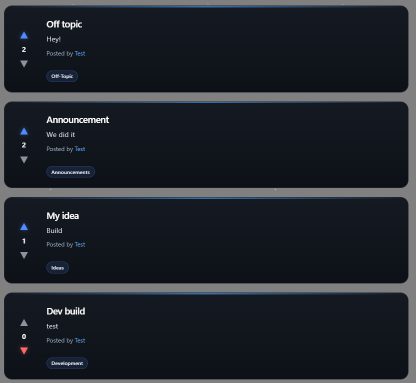
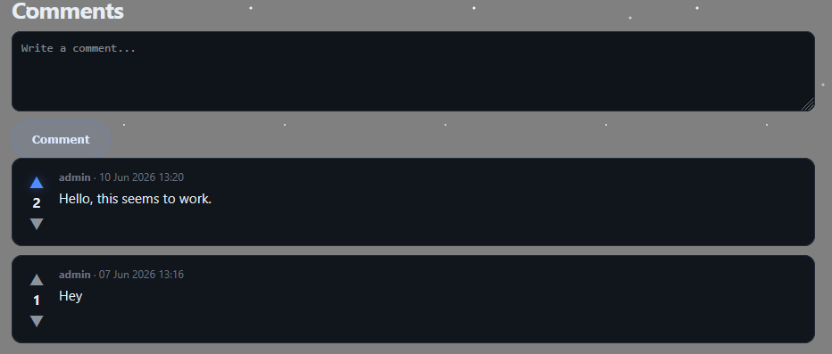
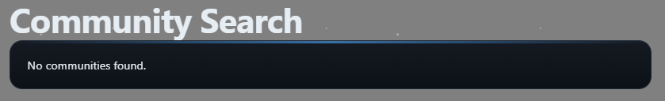
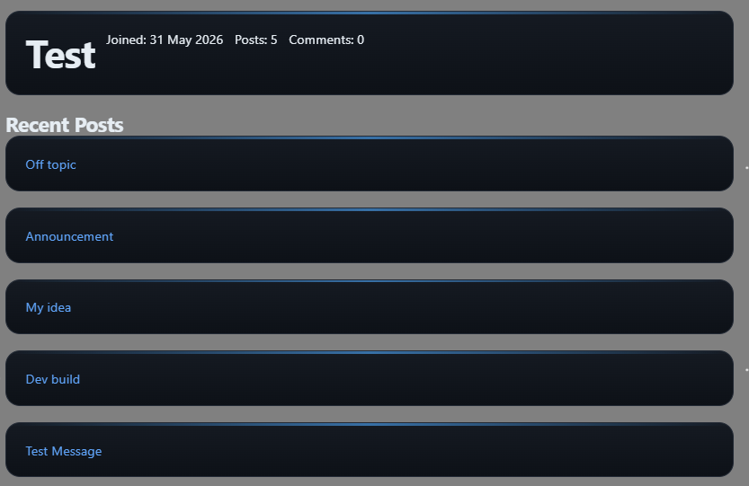
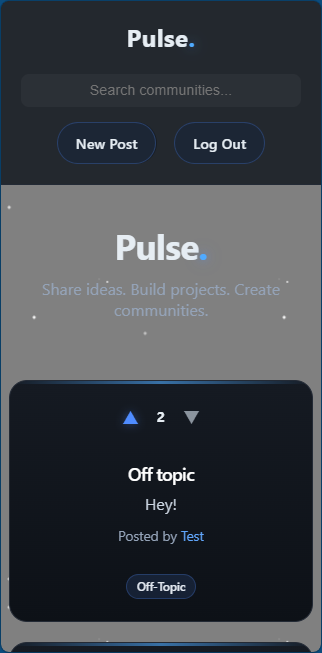

# Pulse – Django Discussion Platform




---

## ⚠️ Important Note

The first commit for this project is considerably larger than would typically be expected.
During the early stages of development, a widely reported Remote Code Execution (RCE) vulnerability affecting a tool within the development ecosystem was disclosed. As a precautionary measure, commits and asset uploads were temporarily delayed until the situation stabilised and it was considered safe to resume normal repository activity.
Development of the project itself continued during this time; however, changes were intentionally withheld from the repository to avoid committing work during a period of uncertainty.
As a result, the initial commit contains a substantial portion of the project that would normally have been distributed across multiple incremental commits.
This approach was taken to maintain a security-conscious and responsible development workflow.

---

## Table of Contents

- [Overview](#overview)
- [Purpose](#purpose)
- [Features](#features)
- [Built With](#built-with)
- [Project Structure](#project-structure)
- [Viewing the Site Locally](#viewing-the-site-locally)
- [User Features](#user-features)
- [User Stories](#user-stories)
- [User Story Mapping](#user-story-mapping)
- [User Story Validation (Screenshots)](#user-story-validation-screenshots)
- [Security](#security)
- [Development Challenges](#development-challenges)
- [Lessons Learned](#lessons-learned)
- [Future Improvements](#future-improvements)
- [Credits](#credits)

---

## Overview

Pulse is a Reddit-style discussion platform built using Django.

It allows users to create posts, comment on content, and interact within a structured community environment.

The project focuses on backend architecture, authentication systems, and full CRUD-based interaction between users and content.

---

## Purpose

This project was developed to:

- Practise Django MVT architecture
- Implement full user authentication flows
- Build a relational database-backed application
- Develop CRUD-based interaction systems
- Explore real-world forum-style application design

---

## Features

- User registration and authentication
- Secure login and logout system
- Create, edit, and delete posts
- Commenting system on posts
- User-owned content permissions
- Timestamp tracking for posts and comments
- Protected routes for authenticated users only
- Clean template-based UI structure

---

## Built With

- **Python** – Core backend logic
- **Django** – Web framework (MVT architecture)
- **HTML5** – Template structure
- **CSS3** – Styling and layout
- **SQLite** – Development database

---

## Project Structure

```
pulse/
├── accounts/
├── posts/
├── comments/
├── templates/
├── static/
├── db.sqlite3
├── manage.py
└── requirements.txt
```

---

## Viewing the Site Locally

Clone Repository

```bash
git clone <https://github.com/MSR-Projects7274/pulse>
cd pulse
```

Create Virtual Environment

```bash
python -m venv venv
```

Activate Environment
Windows

```bash
venv\Scripts\activate
```

macOS / Linux

```bash
source venv/bin/activate
```

Install Dependencies

```bash
pip install -r requirements.txt
```

Apply Migrations

```bash
python manage.py migrate
```

Create Superuser (Optional)

```bash
python manage.py createsuperuser
```

Run Server

```bash
python manage.py runserver
```

Open in your browser:

```
http://127.0.0.1:8000/
```

---

## User Features

- Accounts
- Register new users
- Login and logout system
- Session-based authentication
- Posts
- Create posts
- Edit and delete own posts
- View all community posts
- Individual post detail pages
- Comments
- Add comments to posts
- Edit and delete comments
- Threaded discussion support

---
# User Stories

### New User / Visitor

- As a visitor, I want to register an account so that I can participate in discussions.
- As a visitor, I want to understand what the platform is about so that I know its purpose before signing up.

---

### Authenticated User

- As a user, I want to log in so that I can access my account and interact with content.
- As a user, I want to log out so that I can securely end my session.

---

### Content Creator

- As a user, I want to create a post so that I can share my thoughts with others.
- As a user, I want to edit my posts so that I can correct or update my content.
- As a user, I want to delete my posts so that I can remove content I no longer want visible.

---

### Reader / Community Member

- As a user, I want to view a list of posts so that I can browse discussions.
- As a user, I want to view a single post so that I can read full discussions in context.
- As a user, I want to comment on posts so that I can engage with the community.
- As a user, I want to view comments so that I can follow ongoing conversations.
- As a user, I want to delete my comments so that I can remove content I no longer want displayed.

---

### Explorer / Discovery User

- As a user, I want to search posts so that I can find specific discussions quickly.
- As a user, I want posts ordered by newest first so that I can see the latest activity.
- As a user, I want to browse content easily so that I can discover interesting discussions.

---

### Profile-Focused User

- As a user, I want to view my profile so that I can see my activity and contributions.
- As a user, I want to view other users’ profiles so that I can explore their posts.

---

### Mobile / Multi-Device User

- As a user, I want the interface to be responsive so that I can use the platform on any device.
- As a user, I want navigation to be consistent so that I can move around the site easily.

---

### Engagement-Oriented User

- As a user, I want to like posts so that I can show appreciation for content I enjoy.
- As a user, I want posts to support better formatting so that I can structure my thoughts clearly.

---

# User Story Mapping

| User Story | Implementation |
|------------|---------------|
| User registration | Django auth + custom signup form |
| Login/logout system | Django authentication views |
| Create post | Post model + create view |
| Edit post | UpdateView with author permissions |
| Delete post | DeleteView with confirmation |
| Post feed | ListView ordered by newest |
| Single post view | DetailView with comments |
| Comments system | Comment model linked to Post |
| Delete comments | Owner-restricted delete logic |
| Search posts | Query-based filtering (title/content) |
| Profile pages | User-based post filtering |
| Responsive UI | CSS media queries / flex/grid |
| Navigation system | Base template navbar |
| Like system | Many-to-many user-post relation |

---

# User Story Validation (Screenshots)

The following screenshots provide visual evidence that the key user stories identified for this project have been implemented successfully. The system is designed to support structured discussion, easy navigation, and clear user interaction flows.

<details>
<summary>Click to expand user story validation</summary>

---

### New User / Visitor

**User Need:**  
As a visitor, I want to register an account and understand the platform so that I can decide to join the community.

**Evidence:**  
- Registration form enforces username and password validation rules.  
- Clean landing page introduces platform purpose and navigation options.




---

### Authenticated User

**User Need:**  
As a user, I want to log in, log out, and reset my password so that I can securely manage my account access.

**Evidence:**  
- Login system validates credentials and redirects users appropriately.  
- Logout clears session securely.



---

### Content Creator

**User Need:**  
As a user, I want to create, edit, and delete posts so that I can manage my content freely.

**Evidence:**  
- Post creation form allows structured input for title and content.  
- Edit and delete options are restricted to the post author only.




---

### Reader / Community Member

**User Need:**  
As a user, I want to browse posts and engage with comments so that I can participate in discussions.

**Evidence:**  
- Posts are displayed in reverse chronological order.  
- Comment system is visible under each post with timestamps and user attribution.




---

### Explorer / Discovery User

**User Need:**  
As a user, I want to search and filter posts so that I can find relevant discussions quickly.

**Evidence:**  
- Search functionality filters posts by keywords in title and content.  
- Empty state messaging is displayed when no results are found.



---

### Profile-Focused User

**User Need:**  
As a user, I want to view profiles so that I can explore user activity and contributions.

**Evidence:**  
- Profile pages display user posts and basic account information.  
- Users can view other public profiles without accessing private data.



---

### Mobile / Multi-Device User

**User Need:**  
As a user, I want a responsive interface so that I can use the platform on any device.

**Evidence:**  
- Layout adapts dynamically to screen size.  
- Navigation remains usable across desktop and mobile views.



</details>

---

# Wireframes

Initial layout planning focused on:

- Clear header branding
- Controlled UI spacing
- Minimal navigation

[View desktop wireframes](pulse/wireframes/desktop_designs.png)

[View mobile wireframes](pulse/wireframes/mobile_designs.png)

## Security

- Django authentication system
- CSRF protection enabled
- Permission-based access control
- Secure form validation
- Route protection for authenticated users

---

## Development Challenges

<details>
<summary>Click to expand development challenges</summary>

| Challenge | Issue | Resolution |
|-----------|-------|------------|
| Multi-app URL routing conflicts | Overlapping `urls.py` patterns between apps caused incorrect route matching and occasional 404 errors | Separated URL configurations per app using `include()` and enforced consistent URL namespaces |
| URL namespace and reverse lookup issues | `reverse()` and `` sometimes resolved to the wrong view due to missing or inconsistent namespaces | Standardised `app_name` declarations and refactored URL naming conventions across all apps |
| Shell / model import issues | Django shell could not reliably import models due to incorrect import paths or early app loading issues | Fixed import paths, ensured proper app registration, and used fully qualified model references where needed |
| App registration and load order problems | Certain apps/models were unavailable during migrations or shell sessions due to incorrect `INSTALLED_APPS` ordering | Reordered `INSTALLED_APPS` and validated inter-app dependencies before migration |
| Migration dependency conflicts | Cross-app foreign keys caused migrations to fail or apply in incorrect order | Rebuilt migration chain where necessary and explicitly defined migration `dependencies` |
| Template resolution errors across apps | Django failed to consistently locate templates due to inconsistent folder structure | Standardised template structure using `templates/<app_name>/` and ensured `APP_DIRS = True` |
| Authentication flow inconsistencies | Login/logout sessions behaved unpredictably across different views and redirects | Unified authentication flow, standardised middleware usage, and fixed redirect handling logic |

</details>

---

## Lessons Learned

- Django project structure depends heavily on correct app configuration
- URL routing requires careful namespace management
- Model changes must be migrated carefully to avoid state mismatches
- Django shell is essential for backend debugging
- Authentication flows must be tested end-to-end early

---

## Future Improvements

Potential future improvements include:

- User profiles with avatars
- Notification system
- Rich text editor for posts
- Image uploads
- Moderation tools

---

## Credits

- **Favicons:** [Favicon.io](Favicon.io)
- **Bug fixes and advice:** ChatGPT provided guidance, code extracts and troubleshooting support
- **Favicon Design:** [Perchance.org](https://perchance.org/ai-text-to-image-generator)
